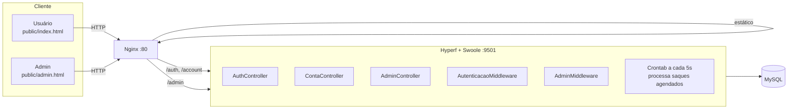

# CasePix

API de saques via PIX construída com Hyperf (PHP + Swoole), com autenticação própria (JWT), painel pessoal para cada usuário e painel administrativo de curadoria.

## Arquitetura



- **Domain**: `Conta`, `Saque`/`SaquePix`, `Dinheiro` (valores em centavos) — regras de negócio sem dependência de framework.
- **Application**: casos de uso (`ProcessarSaque`, `AgendarSaque`, `RegistrarConta`, `AutenticarConta`, etc.) orquestrando domínio + repositórios.
- **Infrastructure**: controllers HTTP, persistência MySQL, autenticação (JWT), cron, e-mail.

## Pré-requisitos

- [Docker](https://docs.docker.com/get-docker/) e Docker Compose

## Subir o ambiente

```bash
cp .env.example .env
```

Edite o `.env` gerado e defina pelo menos:

- `APP_KEY` — chave usada para assinar os tokens JWT. Gere com:
  ```bash
  php -r "echo bin2hex(random_bytes(32));"
  ```
- `ADMIN_EMAIL` e `ADMIN_PASSWORD_HASH` — credenciais do painel admin (não há tabela de admins; a credencial vem do `.env`). Gere o hash com:
  ```bash
  php -r "echo password_hash('sua-senha', PASSWORD_BCRYPT);"
  ```
  **Atenção:** o hash bcrypt contém `$`. Como o Docker Compose interpola `$` em arquivos `.env`, troque cada `$` por `$$` ao colar o hash no `.env`.

Depois:

```bash
docker compose up -d --build
```

O container `api` aguarda o MySQL ficar saudável e executa as migrations automaticamente antes de subir o servidor.

## Serviços disponíveis

| Serviço        | URL                       | Descrição                          |
|----------------|---------------------------|-------------------------------------|
| Painel pessoal | http://localhost          | Cadastro/login + saques (usuário)  |
| Painel admin   | http://localhost/admin.html | Login admin + curadoria de contas |
| API            | http://localhost:9501     | Aplicação Hyperf (também acessível via `http://localhost` através do Nginx) |

## Rodar os testes

```bash
# Unitários (sem dependências externas)
docker compose exec api vendor/bin/phpunit --testsuite Unit

# Integração (requerem MySQL + Swoole rodando)
docker compose exec api vendor/bin/phpunit -c phpunit.integration.xml

# Concorrência (incluído nos de integração acima)
docker compose exec api vendor/bin/phpunit -c phpunit.integration.xml --filter ConcorrenciaSaqueImediatoTest
```

## API

Todas as rotas autenticadas usam `Authorization: Bearer <token>`. O token é obtido em `/auth/login`, `/auth/register` ou `/admin/login` e expira em 7 dias.

### Autenticação (`/auth`)

| Método | Rota             | Descrição                                    |
|--------|------------------|-----------------------------------------------|
| POST   | `/auth/register` | Cria uma conta (`name`, `email`, `password`, `balance` opcional) e retorna token |
| POST   | `/auth/login`    | Autentica com `email` + `password` e retorna token |

### Conta do usuário logado (`/account/me`, requer token de conta)

| Método | Rota                              | Descrição                          |
|--------|-----------------------------------|--------------------------------------|
| GET    | `/account/me`                     | Dados da própria conta               |
| DELETE | `/account/me`                     | Exclui a própria conta (`409` se houver saques) |
| GET    | `/account/me/withdrawals`         | Histórico de saques da própria conta |
| POST   | `/account/me/balance/withdraw`    | Realiza um saque (imediato ou agendado) |

**Saque imediato:**
```json
{
  "method": "PIX",
  "pix": { "type": "email", "key": "usuario@email.com" },
  "amount": 150.75,
  "schedule": null
}
```

**Saque agendado** (fuso `America/Sao_Paulo`):
```json
{
  "method": "PIX",
  "pix": { "type": "email", "key": "usuario@email.com" },
  "amount": 100.00,
  "schedule": "2026-12-31 14:00"
}
```

| Código | Situação |
|--------|----------|
| `201`  | Saque criado (imediato ou agendado) |
| `401`  | Token ausente, inválido ou expirado |
| `404`  | Conta não encontrada |
| `422`  | Saldo insuficiente, data no passado ou dados inválidos |

### Administração (`/admin`, requer token admin)

| Método | Rota                                    | Descrição                                  |
|--------|------------------------------------------|----------------------------------------------|
| POST   | `/admin/login`                          | Autentica com as credenciais do `.env` e retorna token admin |
| GET    | `/admin/accounts`                       | Lista todas as contas                        |
| PATCH  | `/admin/accounts/{id}/balance`          | Ajusta o saldo de uma conta (`balance`)      |
| DELETE | `/admin/accounts/{id}`                  | Exclui uma conta (`409` se houver saques)    |
| GET    | `/admin/accounts/{id}/withdrawals`      | Histórico de saques de qualquer conta        |

## Variáveis de ambiente

| Variável               | Descrição                                                        |
|-------------------------|-------------------------------------------------------------------|
| `APP_KEY`               | Chave de assinatura dos tokens JWT (HS256)                        |
| `ADMIN_EMAIL`           | E-mail do admin (sem cadastro — vem só do `.env`)                 |
| `ADMIN_PASSWORD_HASH`   | Hash bcrypt da senha do admin                                     |
| `DB_HOST`/`DB_PORT`/`DB_DATABASE`/`DB_USERNAME`/`DB_PASSWORD` | Conexão MySQL |
| `MAIL_HOST`/`MAIL_PORT`/`MAIL_FROM_ADDRESS`/`MAIL_FROM_NAME`  | SMTP para notificação de saque (best-effort — ver decisões técnicas) |

---

## Decisões técnicas

### Autenticação e multiusuário

**Um login por conta, sem entidade `Usuario` separada**
A entidade `Conta` ganhou `email` e `senhaHash` diretamente, em vez de criar uma segunda tabela para uma relação 1:1 que nunca existiria em outro formato.

**Admin sem tabela própria**
As credenciais de admin vêm de `ADMIN_EMAIL`/`ADMIN_PASSWORD_HASH` no `.env`. Evita CRUD de administradores que ninguém pediu — há apenas um admin, usado para curadoria da demo.

**JWT (`firebase/php-jwt`)**
Autenticação stateless via `Authorization: Bearer`, compatível com o modelo assíncrono do Swoole (sem sessão em memória compartilhada entre workers). O `role` no payload (`conta` ou `admin`) distingue os dois middlewares de autorização.

**Rotas `/account/me`**
Em vez de checar "o `{id}` da URL pertence ao token?", as rotas de usuário derivam a conta diretamente do token (`sub` do JWT). Elimina uma classe inteira de bugs de autorização (IDOR).

**Usuário comum não edita o próprio saldo**
Ajustar saldo é uma ação exclusiva do admin (útil para "carregar" saldo de demonstração). Em um produto multiusuário real, saldo não é um campo que o próprio usuário deveria poder editar livremente.

### Dentro do escopo do case original

**`SELECT FOR UPDATE` no saque imediato e agendado**
Ao deduzir saldo, o repositório abre uma transação e faz `SELECT ... FOR UPDATE` na linha da conta. Duas requisições concorrentes para a mesma conta ficam serializadas pelo lock — a segunda só lê o saldo após a primeira commitar, tornando impossível deixar o saldo negativo mesmo sob carga paralela.

**Campo `processing_since` para escalabilidade horizontal**
O case pede compatibilidade com múltiplas instâncias. A reserva de saques agendados usa `UPDATE ... WHERE processing_since IS NULL`, operação atômica no MySQL. Apenas a instância que vencer o UPDATE processa aquele saque; as demais pulam. Se o processo morrer antes de concluir, o campo pode ser zerado para reprocessamento.

**Cron a cada 5 segundos (`*/5 * * * * *`)**
Implementado com o componente `Hyperf\Crontab` conforme indicado no case. A expressão de 6 campos (`*/5 * * * * *`) é específica do Hyperf e roda a cada 5 segundos, não a cada 5 minutos.

**Dinheiro em centavos (inteiro)**
A classe `Dinheiro` guarda o valor como `int` de centavos para evitar erros de ponto flutuante. Conversões de/para `string` decimal usam aritmética exata.

**Timezone `America/Sao_Paulo` na entrada, UTC no banco**
Datas de agendamento são recebidas no fuso de Brasília e convertidas para UTC antes de persistir. A cron compara `scheduled_for <= NOW()` em UTC, sem ambiguidades de horário de verão.

**Email não reverte o saque**
A notificação é disparada fora da transação de banco. Falha no SMTP não cancela o saque já registrado — apenas logada. O ambiente local não tem um SMTP real configurado, então o log de falha ao enviar e-mail é esperado ao rodar `docker compose up` sem configurar `MAIL_HOST`.

**Extensibilidade de métodos de saque**
A interface `MetodoDeSaque` separa o conceito de método da lógica de saque. Adicionar TED, boleto ou outra chave PIX exige implementar `MetodoDeSaque` e registrar um handler de notificação — o fluxo central não muda.

### Fora do escopo do case (extras adicionados)

**Autenticação completa e painel admin**
O case original não previa múltiplos usuários. Foi adicionado registro/login com JWT, painel pessoal por conta e um painel administrativo separado para gestão da demo.

**Suíte de testes (unitários + integração + concorrência)**
O case não exige testes automatizados. A suíte cobre domínio, casos de uso, autenticação (tokens, middlewares) e um teste de concorrência real com 20 processos paralelos via `pcntl_fork` para validar as garantias de atomicidade e escalabilidade descritas no case.

**Validação detalhada de input no controller**
O case define a estrutura obrigatória do body mas não detalha respostas de erro. O controller valida `method`, `pix.type`, `pix.key` (formato de acordo com o tipo), `amount` (positivo, máximo 2 casas decimais) e `schedule` (formato `Y-m-d H:i`), retornando todos os erros em uma única resposta `422`.

**Observabilidade via logs estruturados**
Logs JSON estruturados em `runtime/logs/` para cada saque processado, falha de email e execução de cron. Não foi pedido explicitamente, mas o case menciona "observabilidade" como ponto de atenção.

## Deploy no servidor (subdomínio)

### Pré-requisitos no servidor

```bash
# Instalar Docker
curl -fsSL https://get.docker.com | sh

# Instalar Docker Compose plugin
sudo apt install docker-compose-plugin
```

### Subir o projeto

```bash
git clone <url-do-repo> casepix
cd casepix
cp .env.example .env
# Editar .env com as credenciais desejadas (APP_KEY, ADMIN_EMAIL, ADMIN_PASSWORD_HASH, DB_*)
docker compose up -d --build
```

O projeto estará acessível na porta 80 do servidor.

### Configurar subdomínio (Hostinger)

1. Acesse o painel da Hostinger → Domínios → casepix.ygorstefan.com
2. Aponte o subdomínio para o IP do servidor (registro A)
3. Aguarde a propagação DNS (pode levar até 24h)

### HTTPS (opcional mas recomendado)

```bash
sudo apt install certbot
sudo certbot certonly --standalone -d casepix.ygorstefan.com

# Atualizar nginx.conf para incluir SSL e redirecionar HTTP → HTTPS
```

Depois de obter o certificado, editar `docker/nginx/nginx.conf` para escutar na porta 443 com os certificados em `/etc/letsencrypt/live/casepix.ygorstefan.com/`.

### Serviços disponíveis após deploy

| Serviço        | URL                                         |
|----------------|----------------------------------------------|
| Painel pessoal | http://casepix.ygorstefan.com                |
| Painel admin   | http://casepix.ygorstefan.com/admin.html     |
| API            | http://casepix.ygorstefan.com/account, /auth, /admin |
